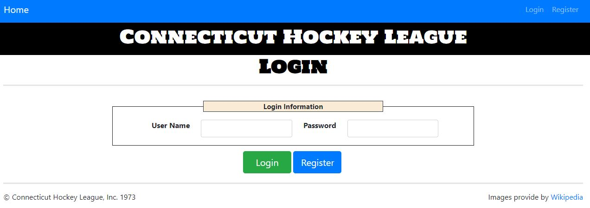
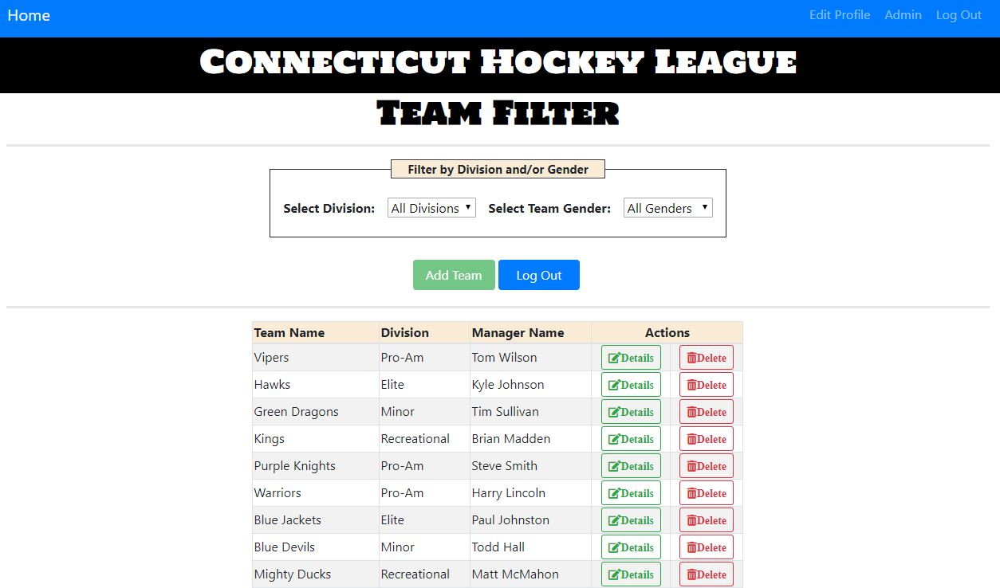
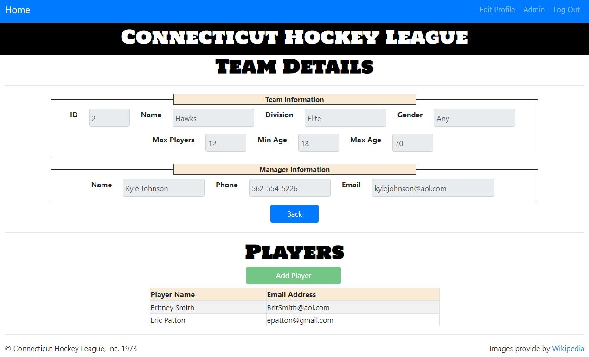

# Connecticut Hockey League (CHL)

## About

This site is allows a user to view all teams, edit teams, add teams, edit players and add players for the Connecticut Hockey League (CHL). 

Home page - Provides a description of each division available in the league and provides buttons to Login and Register. There are also links on the navigation bar for Login and Register.

Login page - The user will need to enter their User Name and Password then click Log In, if authentication is valid then the user will be directed to the Filter Teams page.

Register page - If the user does not have a login they will be able to register for access to the website. User will need to enter a User Name, Password and Email. If registration is successful the user will be directed to the Login page.

Admin page - If a user is an Admin then they will be able to access the Admin page. The page will display a table of registered users (User Name and Email Address).

Filter Teams page - Provides a table list of all the Teams currently in the league. The user will have the ability to filter the list by Division and/or Team Gender. There is a button to add a team (currently unavailable), as well as a button to see the details of a team and a button to delete the team from the league.

Edit User Profile page - Provides the user the ability to change there Email Address. 

Details Team page - Provides the details of the selected team as well as a list of players currently on the team. There is a button to add a team (currently unavailable).

## Audience
- Primary - Currently the site is setup for the admin of the site and anyone else who has the ability to add teams and/or players. Future upgrade will have access for anyone interested in playing, where they can register to play.

## Credits
- Content provided by [wiki](http://www.wiki.com)

## Setup
- Clone / Fork / Download Repo then run npm install.

## Create PostgreSQL User and DB
+ username: hca
+ password: password
+ creds: DBA
+ db name: hca

## Migrate DB
$ cd server\db
$ node migrate

## Start Server
$ cd server
$ npm install
$ npm start

## Stop server
- Ctrl + C

## Server App
http://localhost:3000/
  
## Start Angular Client
$ cd client
$ npm install
$ ng serve

## Stop Angular Client
- Ctrl + C

## Angular App  
http://localhost:4200/

## Reporting issues
Use Github's Issues section for this repository to report any issues with the notes.
Examples of the kind of issues that may need reporting:
- Typos
- Code samples not working as described
- Broken or moved links
- Etc.